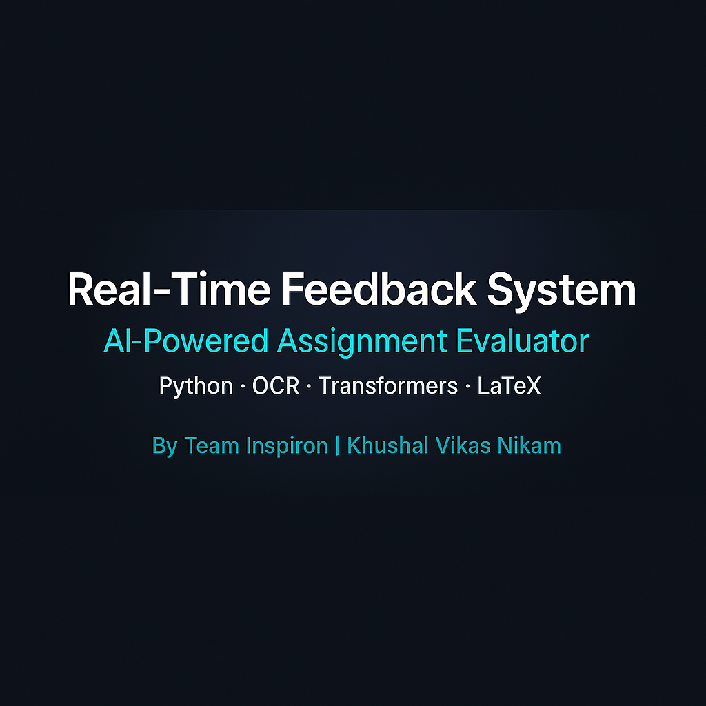

<p align="center">
  
</p>

# Real-Time Feedback System for Assignments

**Domain:** Education Technology  
**Hackathon:** TechFiesta 2025  
**Team Name:** Inspiron  
**Team Leader:** Khushal Vikas Nikam  

## 📌 Overview

A real-time assignment evaluation platform leveraging deep learning, OCR, and Transformer-based models. This system provides instant and personalized feedback on both text and math-based assignments in PDF or image formats.

## 🧠 Key Features

- Upload assignments as **images or PDFs**
- Accepts both **math and textual responses**
- Uses **Vision-based Transformers** for OCR
- **Spelling, context, and logic evaluation** using Encoder-Decoder models
- **Math-to-LaTeX conversion** for math analysis
- Fine-tuned deep learning for **step-by-step correctness**
- Generates **personalized feedback** in **text, visual**, and **voice**
- Suggests **curated learning resources** for improvement
- **Prompt-embedded customization** of assessment rubrics

## ⚙️ Tech Stack

- **Languages:** Python, JavaScript (for frontend if applicable)
- **Frameworks/Libraries:** PyTorch, Transformers (Hugging Face), OpenCV, scikit-learn
- **Other Tools:** OCR (Vision Transformer), LaTeX parsing, SQLite (optional)
- **Deployment:** Local (can work offline), modular microservice-based architecture

## 🔄 Process Flow

1. User uploads PDF/image of assignment
2. System applies **image preprocessing**
3. OCR extracts text using **Vision Transformers**
4. Evaluation:
   - **Text:** via Encoder-Decoder Transformers
   - **Math:** converted to LaTeX for symbolic checking
5. Output: **feedback**, **score**, and **resource recommendations**

## 💼 Use Cases

- Schools & Colleges (educator time saving)
- Online Platforms (e.g., Coursera, Udemy)
- Competitive Exams (quick grading)
- Workshops & Certifications
- HR Assessments

## 🚀 How to Run

```bash
# Clone the repo
git clone https://github.com/<your-username>/RealTimeFeedBackSystem.git
cd RealTimeFeedBackSystem

# Create virtual env & install dependencies
python -m venv venv
source venv/bin/activate  # Windows: venv\Scripts\activate
pip install -r requirements.txt

# Run the app
python app.py
